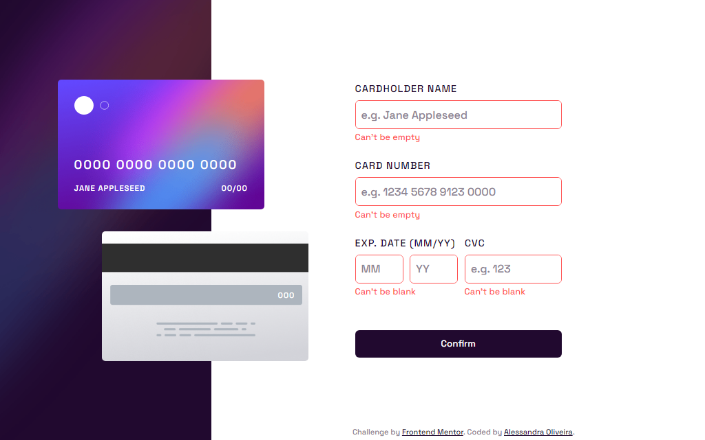
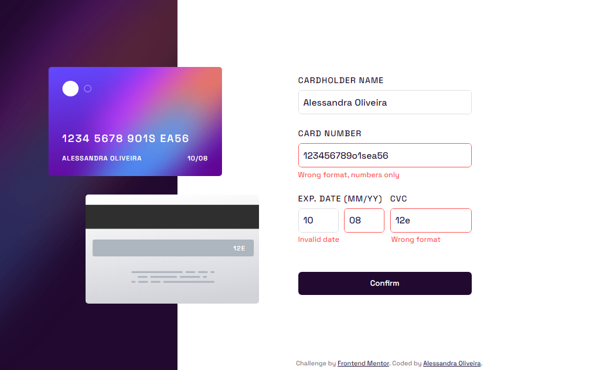
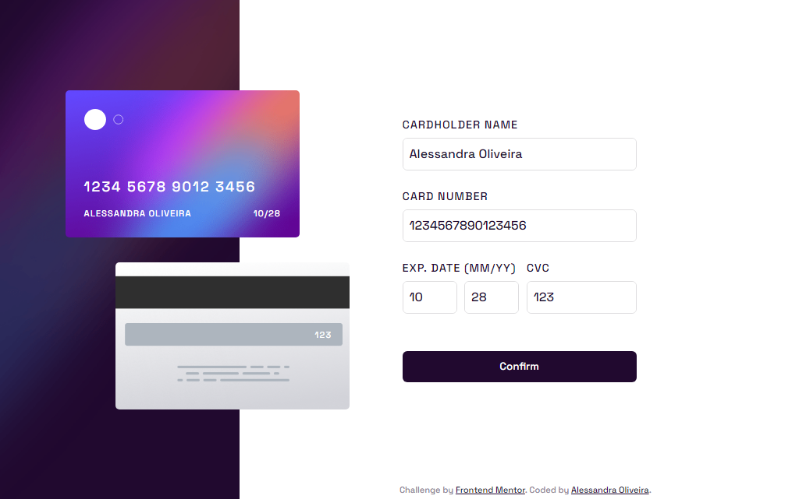

# Frontend Mentor - Interactive card details form solution

This is a solution to the [Interactive card details form challenge on Frontend Mentor](https://www.frontendmentor.io/challenges/interactive-card-details-form-XpS8cKZDWw).

## Table of contents

- [Overview](#overview)
  - [The challenge](#the-challenge)
  - [Screenshot](#screenshot)
  - [Links](#links)
- [My process](#my-process)
  - [Built with](#built-with)
- [Author](#author)

## Overview

This is my solution to the interactive card details form challenge. It was built entirely with HTML, CSS and JavaScript.

### The challenge

Users should be able to:

- Fill in the form and see the card details update in real-time
- Receive error messages when the form is submitted if:
  - Any input field is empty
  - The card number, expiry date, or CVC fields are in the wrong format
- View the optimal layout depending on their device's screen size
- See hover, active, and focus states for interactive elements on the page

### Screenshot

**Desktop Solution:**

  

**Mobile solution:**

  

**Desktop solution with error:** the desktop solution with all fields blank

  

**Desktop solution with error:** the desktop solution with some fields filled with wrong or invalid formats

  

**Desktop solution with NO error:** the desktop solution with all fields correctly filled

  

**Desktop Solution finished:** 

  

**Mobile Solution finished:** 

  

### Links

- Solution URL: [Solution on Frontend Mentor](https://www.frontendmentor.io/solutions/interactive-card-details-form-solution-dmwCgzCts1)
- Live Site URL: [Live site with Github Pages](https://itsale-o.github.io/interactive-card-details-form/)

## My process

### Built with

- Semantic HTML5 markup
- CSS custom properties
- JavaScript

## Author

- LinkedIn - [Alessandra Oliveira](https://www.linkedin.com/in/alessandra-santos-oliveira/)
- Frontend Mentor - [@itsale-o](https://www.frontendmentor.io/profile/itsale-o)
- Twitter - [@itsale_o](https://www.twitter.com/itsale_o)
